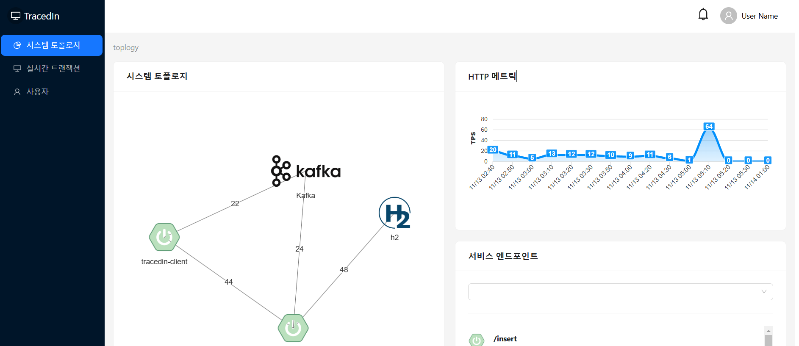
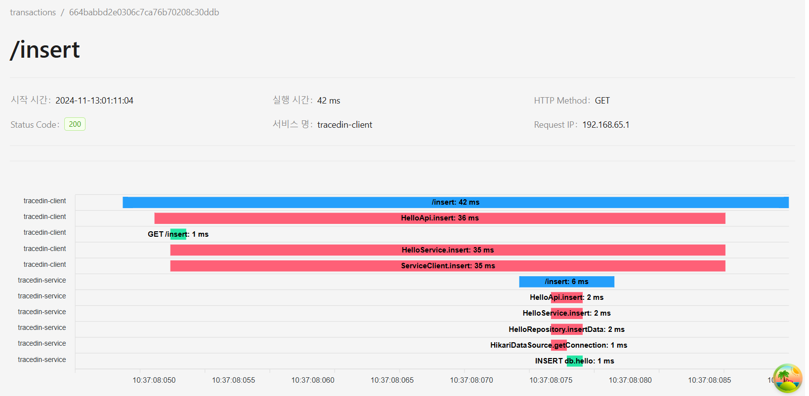
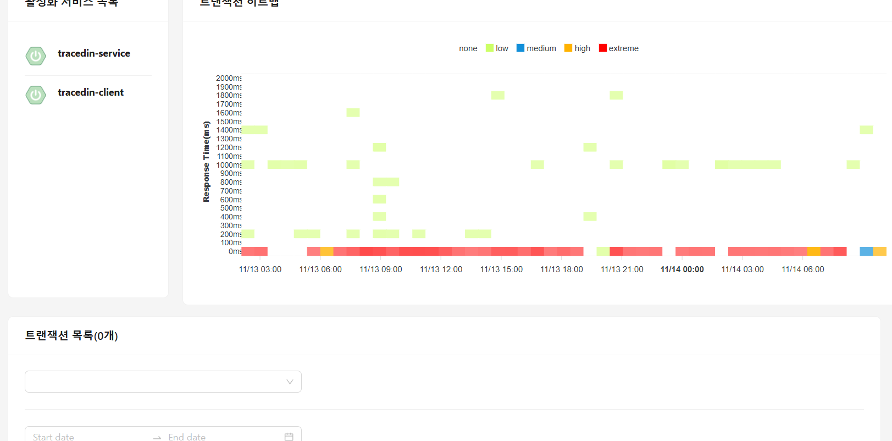
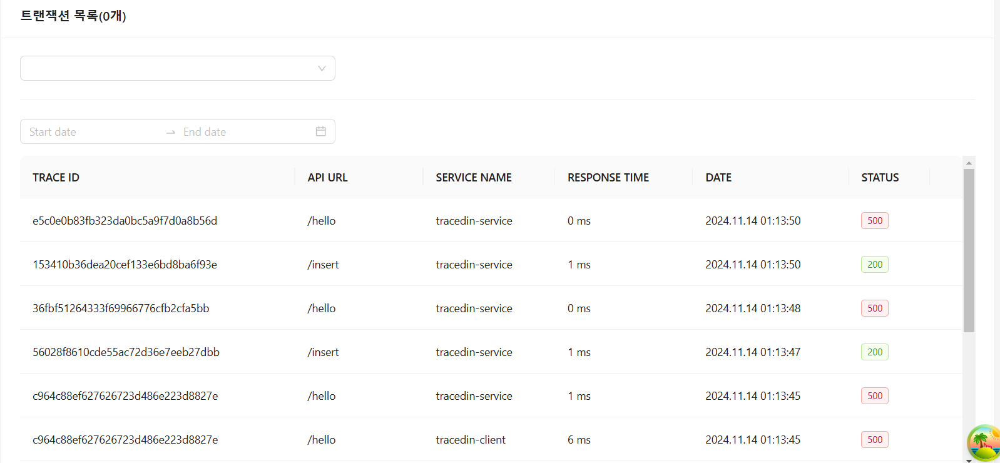

# Tracedin-UI
[](https://app.netlify.com/sites/tracedin/deploys)


This repository is a web UI that visualizes the results collected from Tracedin.

It was featured in the 2024 Capstone Design project at Chungbuk National University.

## 🎨 Layout

You can view [the demo](https://tracedin.netlify.app/) via Netlify.

<p align="center">
    
    
</p>
<p align="center">
    
    
</p>


## 🚀 Getting started

### Install
```shell
npm install
```

### Configure App
The current .env file defines the backend endpoint.

If you want to use a different endpoint, please configure it through the environment variable.
```shell
export VITE_TRACEDIN_API=CUSTOM BACKEND ENDPOINT
```

### Start
```shell
npm start
```
### build for production
```shell
npm run build
```
